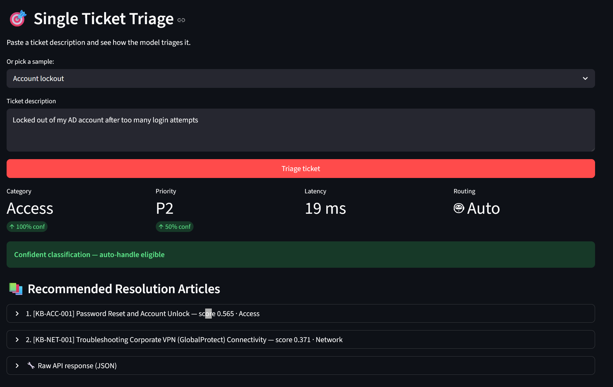
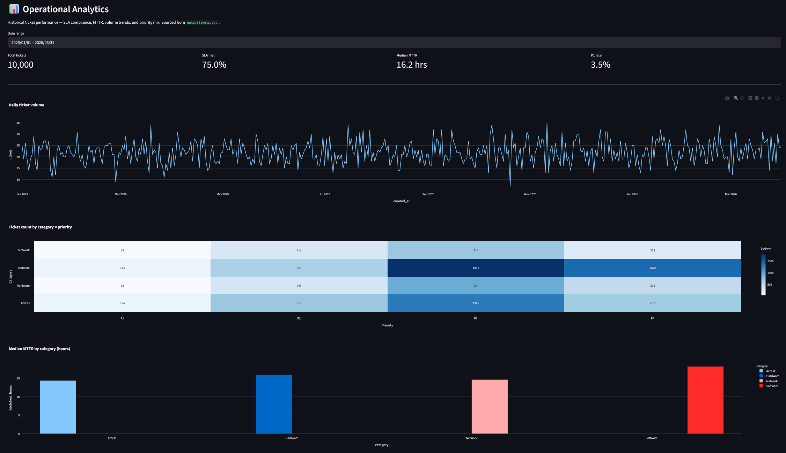
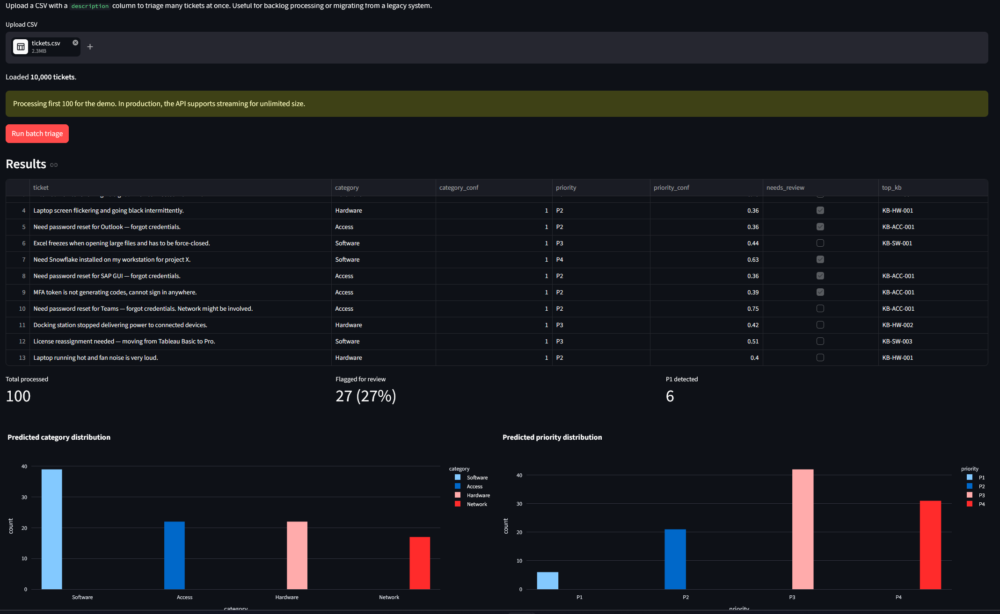
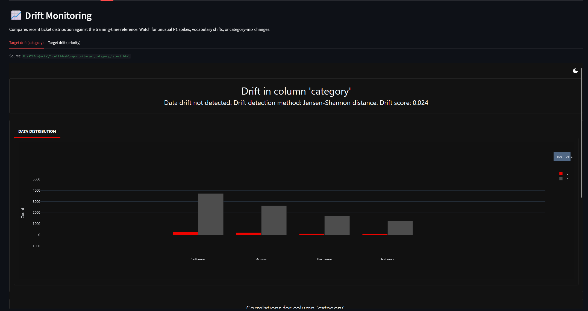
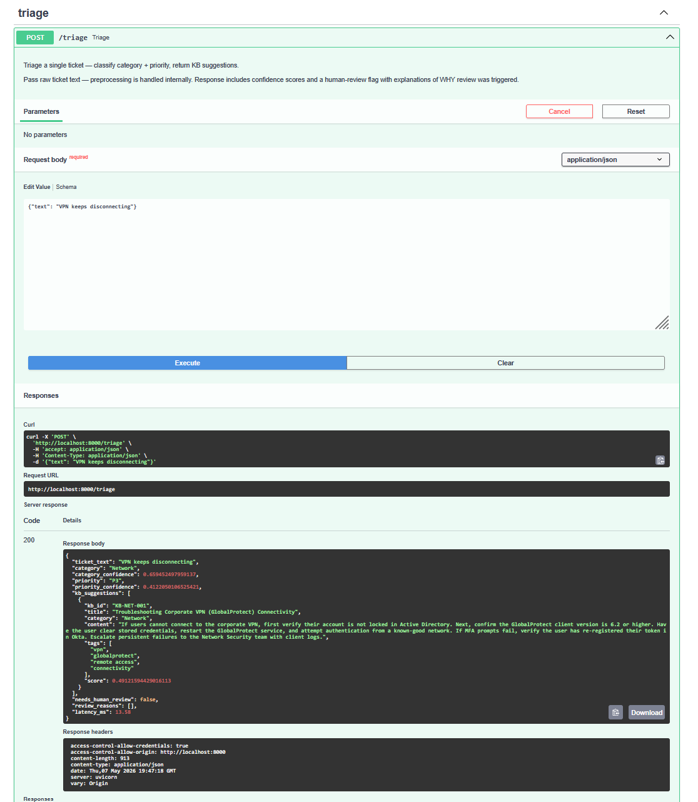
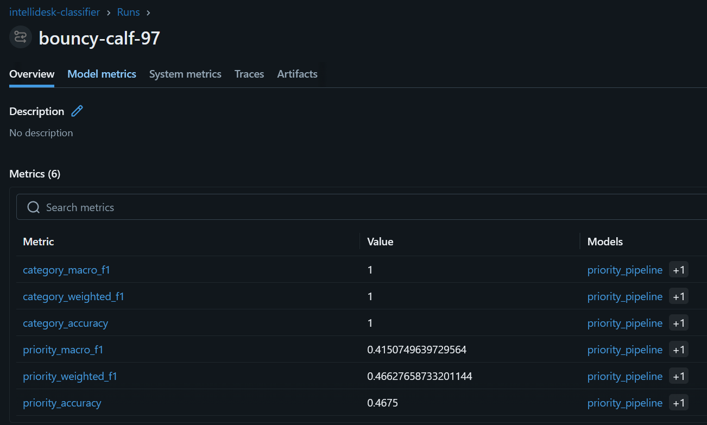
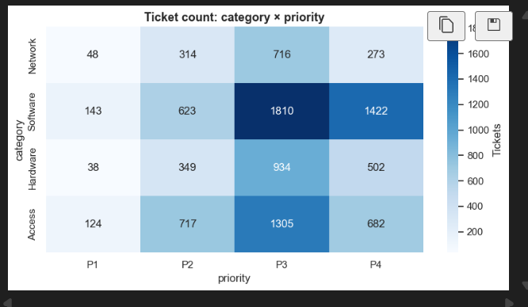
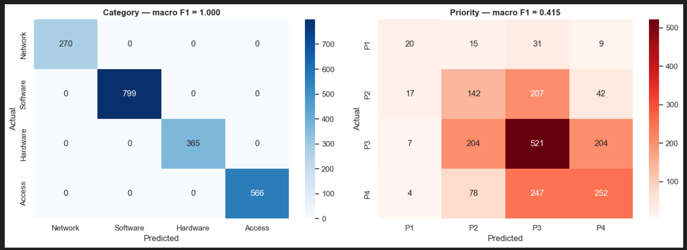
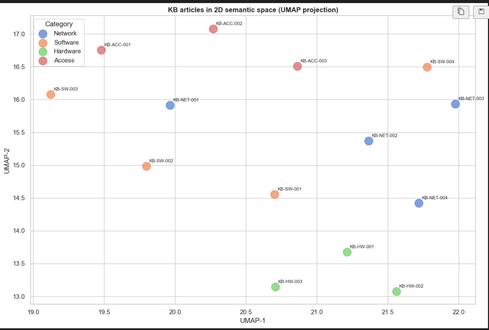
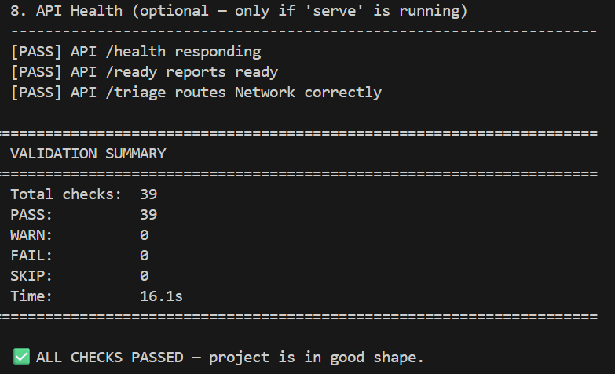

# IntelliDesk

IntelliDesk is an ML-powered IT service desk triage project. It classifies incoming tickets by category and priority, recommends relevant knowledge base articles, and flags low-confidence cases for human review.

I built it to practice the full ML engineering workflow around a realistic support use case: synthetic data generation, preprocessing, model training, semantic retrieval, API serving, dashboarding, drift monitoring, tests, validation, Docker, and CI.

## What it does

You hand it a ticket like "VPN keeps disconnecting from my home office." It returns:

- A category (Network)
- A priority (P3)
- The top 3 most relevant KB articles
- A flag for whether a human should review the prediction

The whole thing runs in under 200ms once the models are warm. Same pipeline runs through a REST API, a Streamlit dashboard, a CLI, and inside Docker.

## Screenshots

| | |
|:-:|:-:|
|  |  |
| **Triage tab** — classifier predictions and KB suggestions | **Analytics tab** — operational KPIs and trends |
|  |  |
| **Batch processing** — bulk triage with distribution charts | **Drift monitoring** — Evidently report inline |
|  |  |
| **FastAPI** — auto-generated Swagger UI | **MLflow** — experiment tracking across runs |
|  |  |
| **EDA notebook** — category x priority heatmap | **Modeling notebook** — confusion matrices |
|  |  |
| **Embeddings notebook** — KB articles in 2D | **Validation suite** — 39 checks across 8 sections |

## Quick start

```powershell
git clone https://github.com/phanipal/Intellidesk.git
cd Intellidesk

# Set up the venv (Windows PowerShell)
python -m venv .venv
.\.venv\Scripts\Activate.ps1
.\make.ps1 install

# Generate data, train, build the retriever
.\make.ps1 data-all
.\make.ps1 train-quick
.\make.ps1 build-index

# Run the service and dashboard in two terminals
.\make.ps1 serve         # API on http://localhost:8000
.\make.ps1 dashboard     # UI on http://localhost:8501
```

Or skip all of that and use Docker:

```bash
docker compose up
```

Same result. Both services come up, dashboard talks to the API automatically.

## Architecture

```
        +-------------------------------------------+
        |          Streamlit Dashboard              |
        |   Triage  Batch  Analytics  Drift  KB     |
        +----------------------+--------------------+
                               | HTTP (offline fallback)
        +----------------------v--------------------+
        |              FastAPI Service              |
        |   /triage  /triage/batch  /health  /docs  |
        +----------------------+--------------------+
                               |
        +----------------------v--------------------+
        |          TicketTriagePipeline             |
        +-------+-------------------------+---------+
                |                         |
       +--------v---------+      +--------v---------+
       |   Classifier     |      |  KB Retriever    |
       | TF-IDF + XGBoost |      | MiniLM + FAISS   |
       | Two pipelines:   |      | Cosine top-k     |
       | category + pri   |      |                  |
       +------------------+      +------------------+
```

Two models, one orchestrator. Classifier is fast and deterministic. Retriever handles the semantic side. They have different blind spots, so the pipeline returns both. Defense in depth.

## The interesting parts

### Class imbalance: standard advice failed

P3 tickets are 50% of the data. P1 tickets are 4%. That's a 12:1 ratio. Standard ML advice says apply balanced class weights to fix it.

I tried that. Priority macro F1 stayed at 0.31 (no improvement) and the model started over-predicting P1. False positives spiked. The 12:1 weighting made the loss function dominated by rare-class errors, and precision collapsed.

What worked was sqrt-scaled weights, around 3.5:1 instead of 12:1. F1 jumped to 0.45. Lesson: imbalance fixes need calibration, not reflexes.

### Train/serve skew

Spent two hours debugging why the classifier got perfect F1 in training but failed obvious cases at predict time. Training data was lemmatized through spaCy. Predict() got raw text. So TF-IDF learned the token "crash" but inference saw "crashes" and matched nothing.

Fix was to bake preprocessing into predict() so callers pass raw text and the classifier handles normalization internally. Classic ML production bug, well documented in the literature, still bit me.

### Defense in depth

Sometimes the classifier gets a ticket wrong but the retriever surfaces the right KB anyway. Example: "SSO outage affecting finance team" gets misclassified as Software (because "SSO" appears in only one training template), but the retriever returns KB-ACC-003 (SSO Outages) as top-1 with high confidence. The pipeline returns both, so the analyst sees the right resolution even when the classifier blinks.

Two models with different failure modes is more reliable than one model with high accuracy.

### Synthetic data has a ceiling

My category F1 is 1.000 on test data. That sounds like a model achievement. It isn't. The synthetic templates have non-overlapping vocabulary (Network templates use VPN/WiFi/DNS, Software templates use Outlook/Excel/Tableau, etc.) so any reasonable classifier can split them cleanly. Real tickets are ambiguous. "Outlook is slow" could be Software, Network, or Hardware depending on cause.

I document this as a known limitation. The fix in production would be active learning: take real tickets the classifier marks for human review and feed them back as training data. Closes the gap between synthetic and real over time.

## Note on data

This project uses synthetic IT service desk tickets because real ITSM data contains private user, system, and incident details. The goal is to show the ML engineering workflow around ticket triage: data generation, preprocessing, training, retrieval, API serving, dashboarding, monitoring, testing, validation, Docker, and CI.

## Development notes

A few issues I ran into while building this:

- Train/serve skew: training used preprocessed text but prediction initially received raw text, so the model learned cleaned tokens while inference saw raw ones. Fixed by moving preprocessing inside the classifier's predict path.
- Class imbalance: full balanced class weights made the priority model over-predict P1. Sqrt-scaled weights worked better for this distribution.
- Synthetic data ceiling: category F1 is high because templates use cleaner vocabulary separation than real tickets would. Documented as a known limit.
- Dashboard import path: Streamlit runs from the dashboard directory, so the app adds the project root to sys.path before importing from src.
- API/dashboard split: the dashboard calls the FastAPI service when it's available and falls back to an in-process pipeline for offline demos.

## Example outputs

| Ticket | Category | Priority | Top KB |
|---|---|---|---|
| VPN keeps disconnecting every 10 minutes from home office | Network | P3 | KB-NET-001 |
| Outlook crashes when opening large email attachments | Software | P3 | KB-SW-001 |
| Locked out of my AD account after too many login attempts | Access | P2 | KB-ACC-001 |
| Cannot print to the office printer, job stays in queue | Hardware | P3 | KB-HW-001 |

## Known limitations

- The dataset is synthetic, so category vocabulary is cleaner than real tickets.
- Category F1 is likely inflated because templates use distinct terms like VPN, Outlook, printer, and MFA.
- Real deployment would need active learning, human-review feedback, and periodic retraining.
- The Streamlit dashboard suits portfolio and internal demo use, not a production analyst UI.
- The retriever uses a small local embedding model. Production search would likely need hybrid retrieval, reranking, and access control.

## Production next steps

If deployed in a real ITSM environment, I would add:

1. ServiceNow or Jira connector for real ticket ingestion.
2. Human-review feedback loop for active learning.
3. Request-level logging with sampling and PII controls.
4. Hybrid keyword and semantic retrieval with reranking.
5. Role-based access control for KB articles.
6. Model monitoring on real production traffic.
7. Scheduled retraining pipeline.
8. A proper analyst UI instead of Streamlit.

## Project structure

```
intellidesk/
├── src/
│   ├── config.py             Paths, constants, thresholds
│   ├── generate_data.py      Synthetic ticket generator
│   ├── generate_kb.py        Knowledge base
│   ├── preprocess.py         PII scrubbing + lemmatization
│   ├── classifier.py         TF-IDF + XGBoost (dual pipeline)
│   ├── retriever.py          sentence-transformers + FAISS
│   ├── pipeline.py           Orchestrator
│   └── api.py                FastAPI service
├── dashboard/
│   └── app.py                Streamlit UI
├── monitoring/
│   └── drift_report.py       Evidently AI drift reports
├── notebooks/
│   ├── 01_eda.py             Data exploration
│   ├── 02_modeling.py        Model design + error analysis
│   └── 03_embeddings.py      Retrieval + UMAP visualization
├── tests/                    8 test suites, ~50 cases
├── docs/screenshots/         README images
├── data/                     Generated tickets + KB
├── models/                   Trained classifier + FAISS index
├── reports/                  Drift reports (HTML)
├── make.ps1                  PowerShell task runner
├── run_validate.py           39-check validation suite
├── run_tests.py              Per-file test runner
├── run_demo.py               End-to-end demo script
├── Dockerfile
├── docker-compose.yml
└── .github/workflows/ci.yml
```

## Tech stack

**ML**: scikit-learn, XGBoost, sentence-transformers, FAISS, NLTK, spaCy
**Service**: FastAPI, Pydantic, uvicorn
**UI**: Streamlit, Plotly
**Tracking**: MLflow
**Monitoring**: Evidently AI
**Testing**: pytest
**Container**: Docker, docker-compose
**CI**: GitHub Actions

## Running the test suite

```powershell
.\make.ps1 test-all       # per-file with PASS/FAIL summary
.\make.ps1 test-all-cov   # with coverage report
.\make.ps1 validate       # 39-check sanity audit
```

Validation runs 8 sections: data integrity, ticket-category alignment, knowledge base integrity, model artifacts, classification metrics, retrieval relevance, end-to-end pipeline, and API health. Designed to catch regressions before they hit GitHub.

## What I'd do differently

If this were a production project I'd:

1. Use a real ticket dataset. Synthetic data has a ceiling because templates can't capture the long tail of weird tickets you see in production.
2. Add active learning. Tickets flagged for review become labeled examples for the next training cycle. Closes the loop.
3. Move beyond MLflow once the team grows past 2-3 people. Weights & Biases or Neptune scale better for collaboration.
4. Add request-level logging with sampling. Drift monitoring needs production samples to compare against the training distribution, and right now we don't capture them.
5. Replace Streamlit with Next.js for analyst-facing production UI. Streamlit is great for portfolio demos and internal tools but you hit its limits when users want real interactivity.

## License

MIT. Use it however you want.

## Author

Phanendra Paladugu